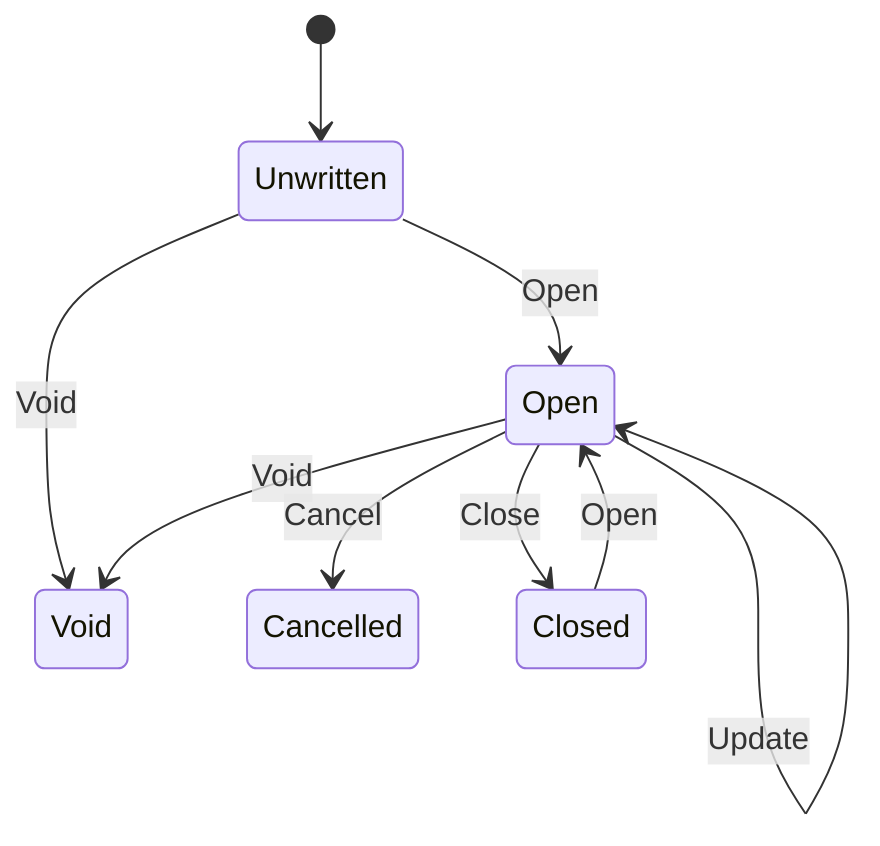
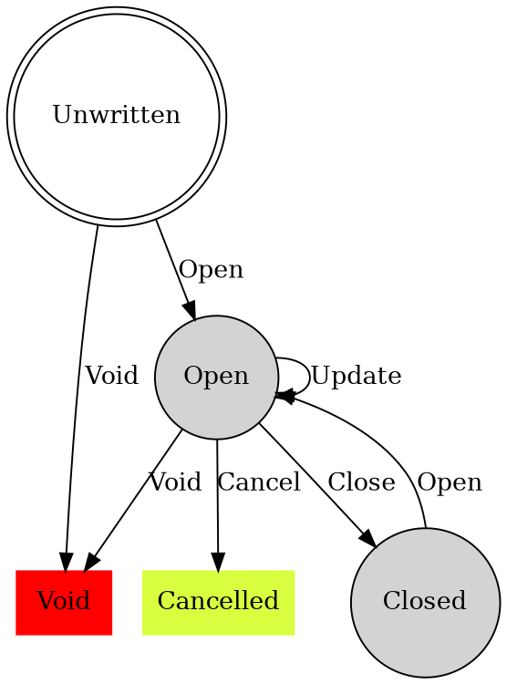

- color

```diff
- text in red
+ text in green
! text in orange
# text in gray
```

- jump

<a href="#top">Back to top</a>

- checkbox

- [x] Write the press release
- [ ] Update the website
- [ ] Contact the media

- yes and no

✅ &#9745;
❌ &#9746;

- diagram


- graphviz

<a href="index.md">Back to home</a>
